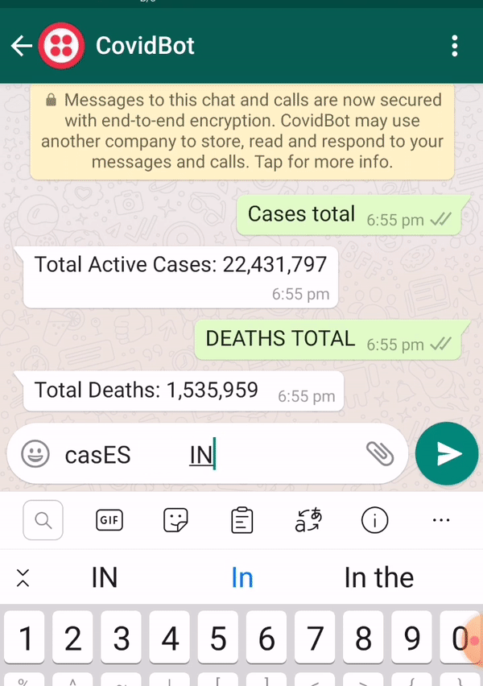

# DurCov - The Covid-19 Whatsapp Inquiry Machine 
###### It's actually just a toy app with 4 types of commands

## Repo Structure
* Just to make it easier/faster on first read, here's a brief overview of the repository's structure.
    * The code for the two executables (`poll` and `web`) live inside the `cmd` directory.
    * The package they both use (i.e the shared functionality) lives in the root of the project and have the `durcov` package providing namespacing. 
    * I tend to prefer flat file structures unless compelled to organize into folders but I believe the file names and code should be self-explanatory.
    * This may be easy to miss but the heroku build instructions are a combination of the `Procfile` and the build tags at the very top of the `go.mod` file.

## Tools
* I chose Go because that's the language I've been working with recently. For a lasting application I'd probably use something else because there isn't an officially maintained `twilio-sdk` for Go.
* I chose `Heroku` because I wanted to try it. (I like it, I'll probably use it for personal projects/experiments going forward. Very fast zero-to-deployed platform.)
* Postgres.

## Assumptions (or the fine art of taking shortcuts?)
* The doc mentions two services. My implementation might not meet everyone's definition because to some that could mean isolated applications communicating over a network but to me that meant:
    * Modular 
    * Composable
    * Decoupled
    * Focused Responsibility
* I actually had to look around for the definition of an "Active" case. It looks like it's context dependent but the API linked in the doc (the one I used) doesn't really mention "Active" so I took it to mean the following:
    * Active = Confirmed - (Deaths + Recovered)
    * An active case is a confirmed case that hasn't died or recovered yet.
* My interpretation of "total no. of..." is "as of" today. Which means I don't store or return data specific to the day (as in not the difference between Day1 and Day 2 but the running total as of Day 2).

## So about my services. They're..
* actually a combination of a server and a scheduled task. Implementing two applications with possibly a scheduler+queue felt like overkill because:
    * There's only one job to do.
    * It's not long-running.
    * It's not state/event dependent.
    * Consistent schedule.
* Database access is wrapped by function-specific API's that both the task script and web service use. Switching a database for either piece means simply changing the connection used and extending the package.
* The scheduled task spins up it's own one-time "dyno" (Heroku's name for a container) while the web server is a continuously running (not quite true because the free tier goes to sleep after 30 mins of inactivity).

## Testing
* I only included the tests I actually used for feedback while implementing the app. `tests.sh` is a script I used for setting up the tests locally and presumes you have postgres installed.
* If I were to continue developing an application (or/and) I was working in a team I would've:
    * Setup CI tests. (Probably with Heroku's nice managed test db offering. It's paid though)
    * Run tests in a container for easy reproducibility.
* Some tests are what could be defined as integration tests and others unit tests but I like orgazining by relevance and not type so they co-exist in the same file. Maybe I could've abstracted away some of the setup but I only needed setup for maybe 2 tests.

## Heroku
* The free tier means the web server goes to sleep after 30 minutes of inactivity. There's a 3-8 second delay on the first response after a cold start.
* I use the heroku scheduler to poll every hour. This might actually be too frequent because the API service doesn't seem to update that frequently. (More on this later)
* I looked into how to decleratively describe app configurations and I'm slightly dissapointed that the config file used has to be hand written and there aren't any tools (atlease from heroku) to generate one for you. I didn't write one but these are the features I used:
    * single "dyno" for the web-server
    * postgres
    * scheduler
    * secrets management
    * TLS (this actually comes with any `*.herokuapp.com` domain)
* Unfortunately developer-defined permissioned access to the database is a paid feature which means all access is as a superuser. The `pgx` package I use as a postgres driver caches queries by default so they work like prepared statements.(This point actually relates to SQL injection and not heroku directly) 

## Oh-oh! REGEX!
* I'd usually stay away from regex for most use cases but it made sense here (for pattern matching on incoming messages) because:
    * Small amount of short commands.
    * Allows me to white-list input instead of trying very hard to black-list bad input.
    * Extract and validate very succinctly.
* I considered writing just a lexer+parser because they're easy (relatively) to extend but I'm probably not going to be working on this project so just went with the regex solution.
* I capped the length of incoming messages just because the compiled regex takes linear time to match input. (This is because I'm lenient with delimiting whitespace in the input)

## Considerations (or things I should've done)
* The API used (and other similar API's) allow subscribing to updates (by registering a webhook) which means we'd only make network requests as necessary. But that's API provider specific and the doc mentioned polling, so I polled away.
* Rate limiting. Twilio itself has some sort of rate limiting but I'd have some simple application level rate limiting as well. (We do authenticate the requests coming so there's a bit of protection.)
* Health checks, context tracking/tracing for audit logging, audit logging, tiered logging and all the other nice web middleware. I only had one route here so just logged the essentialls.
* Maybe sessions? Although I don't know how much that matters for an app like this.
* Graceful shutdowns, emergency request caching/queing etc. Availability enhancement.

## Demo 
* All commands are case insensitive and there's some amount of lenience for how much space is used between the command and the code.
### Global commands
* 

### Country specific commands. ( I added the country name for better feedback)
* 

### Some error handling
* 
